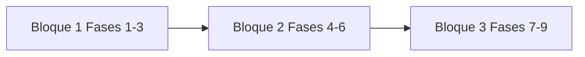

# SYGOS 3.0 — Construcción en 3 bloques

Este documento agrupa las **9 fases** de [`SYGOS_3.0_DISCOVERY_FINAL.md`](./SYGOS_3.0_DISCOVERY_FINAL.md) y [`SYGOS_3.0_PLAN_VALIDACION_FINAL.md`](./SYGOS_3.0_PLAN_VALIDACION_FINAL.md) en **3 iteraciones** sustanciales para revisión funcional y técnica.

Cada bloque debe pasar **todas** las comprobaciones de sus fases antes de considerarse cerrado.

---

## Bloque 1 — Operación y activos (Fases 1–3)

### Alcance

- Empresas, contexto activo, usuarios/roles, configuración e integraciones configurables.
- Clientes, contactos, prospectos, proveedores (incl. intercompañía `SYSTRON` / `Servomotores`).
- Folios, búsqueda global restringida, concurrencia y cancelaciones.
- EQUI, MOT (secuencia global), almacén SYSTRON, ingreso/resguardo/egreso Servomotores, salida a prueba.
- Inventario SYSTRON; inventario Servomotores deshabilitado/habilitable por Administrador.
- Diagnóstico, validación Gerente Operativo, bitácora, reparación preautorizada, OS, SLA, garantías, servicio externo.
- Flujo MOT SYSTRON ↔ Servomotores y reflejo solo lectura de estado/bitácora en SYSTRON.

### Entregable revisable

Producto usable para: alta de maestros, identidad física, custodia y **ciclo técnico completo** (incl. intercompañía), sin aún cerrar cotización comercial ni fiscal.

### Validación

Checklist completo de **Fase 1, Fase 2 y Fase 3** en el Plan de Validación.

---

## Bloque 2 — Comercial y dinero (Fases 4–6)

### Alcance

- Bandeja unificada `Pendiente de cotizar`, cotizaciones, descuentos, intercompañía comercial, venta de equipo, servicio en campo, panel ventas, agenda/metas.
- Facturación, remisiones, pagos, CxC/cobranza, factura libre, intercompañía fiscal y pagos reales entre empresas.
- Compras directas, límites Gerente, O.C. (autorización CEO), finanzas y CxP por empresa, dashboard financiero **por empresa activa**.

### Entregable revisable

Recorridos **comercial + fiscal + tesorería + compras** operables en SYSTRON y Servomotores, con espejo intercompañía coherente.

### Validación

Checklist completo de **Fase 4, Fase 5 y Fase 6** en el Plan de Validación.

---

## Bloque 3 — Personas, control y cierre (Fases 7–9)

### Alcance

- Personal/RRHH, kiosco, vacaciones, prima vacacional, nómina, horas extra, bonos, aguinaldo, comisiones (reglas Servomotores incluidas).
- Producción técnica, panel CEO, panel Coordinación, paneles técnicos/comercial, reportes por empresa.
- Integraciones completas, errores/reintentos, documentos, responsive/PWA, **Modo de Pruebas**, recorridos E2E definidos en Fase 9.

### Entregable revisable

SYGOS 3.0 **validado extremo a extremo** según criterios del Discovery, listo para operación controlada en producción.

### Validación

Checklist completo de **Fase 7, Fase 8 y Fase 9** en el Plan de Validación.

---

## Dependencia entre bloques

No se recomienda iniciar Bloque 2 sin maestros, MOT/custodia y técnica estables; Bloque 3 asume flujos comerciales y financieros cerrados en Bloque 2.
